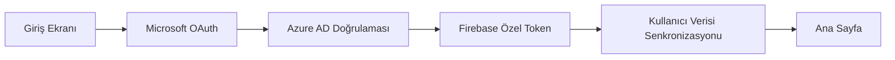

# 🎓 MedipolApp - Üniversite Kampüs Uygulaması

<div align="center">
  
  <br><br>
  <strong>Medipol Üniversitesi için geliştirilmiş kapsamlı Flutter tabanlı kampüs uygulaması</strong>
  <br><br>
  
  [](https://flutter.dev)
  [](https://firebase.google.com)
  [](https://azure.microsoft.com)
  
</div>

## 📱 Uygulama Hakkında

MedipolApp, Medipol Üniversitesi öğrencilerinin tüm kampüs deneyimini parmaklarının ucuna getiren özellik açısından zengin bir üniversite kampüs uygulamasıdır. Akademik takvimden kafeterya menülerine, QR erişim kodlarından interaktif kampüs haritalarına kadar bu uygulama üniversite yaşamı için dijital bir yardımcı olarak hizmet vermektedir.

## ✨ Özellikler

### 🔐 **Hibrit Kimlik Doğrulama Sistemi**
- **Microsoft OAuth (MSAL)** - Üniversite kimlik bilgileri ile sorunsuz giriş
- **Firebase Authentication** - Gelişmiş güvenlik için ikincil kimlik doğrulama
- **Güvenli Token Depolama** - Flutter Secure Storage kullanarak şifrelenmiş depolama
- **Otomatik Giriş** - Hızlı erişim için kimlik bilgilerini hatırla

### 🏛️ **Temel Kampüs Hizmetleri**
- **📅 Akademik Takvim** - Önemli tarihler, sınavlar ve etkinlikleri interaktif takvimle görüntüleme
- **🍽️ Kafeterya Menüleri** - Detaylı bilgilerle günlük yemek seçenekleri
- **🗺️ İnteraktif Kampüs Haritası** - Özel karanlık tema stiline sahip Google Maps entegrasyonu
- **📢 Gerçek Zamanlı Duyurular** - Üniversite haberleri ve bildirimleri ile güncel kalın
- **📊 Ders Notları** - Akademik performans ve ders sonuçlarını görüntüleme
- **📬 Gelen Kutusu & Bildirimler** - Merkezi mesajlaşma sistemi

### 📱 **Akıllı Kampüs Özellikleri**
- **📱 QR Erişim Kodları** - Kampüs tesisleri erişimi için QR kod oluşturma
- **📸 QR Tarayıcı** - Kampüs hizmetleri için yerleşik tarayıcı
- **🚌 Kampüs Ulaşımı** - Rota bilgileri ve programları
- **📞 Yardım & Destek** - Üniversite destek hizmetlerine doğrudan erişim
- **🎯 Yaklaşan Etkinlikler** - Kampüs aktivitelerini ve etkinlikleri keşfedin

### 🎨 **Kullanıcı Deneyimi**
- **🌓 Karanlık/Açık Tema** - Yumuşak geçişlerle uyarlanabilir temalar
- **🌐 Çok Dil Desteği** - Türkçe ve İngilizce yerelleştirme
- **📱 Duyarlı Tasarım** - Tüm ekran boyutları için optimize edilmiş
- **⚡ Gerçek Zamanlı Senkronizasyon** - Firebase destekli canlı veri güncellemeleri
- **📊 Analytics Entegrasyonu** - Sürekli iyileştirme için kullanım takibi

## 🏗️ Mimari

### Teknoloji Yığını
```
Frontend: Flutter 3.8.0+ with Dart
State Management: Provider Pattern
Authentication: Microsoft MSAL + Firebase Auth
Backend: Firebase (Firestore, Storage, Analytics, FCM)
Haritalar: Google Maps Flutter with custom styling
Localization: Flutter i18n with ARB files
```

### Proje Yapısı
```
lib/
├── 📁 constants/          # Uygulama genelinde sabitler ve konfigürasyon
├── 📁 models/             # JSON serileştirme ile veri modelleri
├── 📁 providers/          # State management (Auth, Theme, Language)
├── 📁 screens/            # 17 özellik ekranı
├── 📁 services/           # İş mantığı ve API servisleri
├── 📁 widgets/            # Yeniden kullanılabilir UI bileşenleri
├── 📁 themes/             # Açık/Karanlık tema tanımları
└── 📁 l10n/              # Yerelleştirme dosyaları (TR/EN)
```

## 🚀 Başlangıç

### Ön Koşullar
- Flutter SDK 3.8.0 veya üzeri
- Dart SDK 3.0.0 veya üzeri
- Mobil geliştirme için Android Studio / Xcode
- Firebase proje kurulumu
- Google Maps API anahtarı
- Microsoft Azure AD uygulaması

### Kurulum

1. **Repository'yi klonlayın**
   ```bash
   git clone https://github.com/yusufbilgic14/5Myusuffork.git
   cd 5Myusuffork
   ```

2. **Bağımlılıkları yükleyin**
   ```bash
   flutter pub get
   ```

3. **Model sınıfları oluşturun**
   ```bash
   flutter pub run build_runner build --delete-conflicting-outputs
   ```

4. **Firebase'i yapılandırın**
   - `google-services.json` dosyasını `android/app/` içine yerleştirin
   - `GoogleService-Info.plist` dosyasını `ios/Runner/` içine yerleştirin

5. **Microsoft MSAL'ı yapılandırın**
   - `assets/msal_config.json` dosyasını Azure AD ayarlarınızla güncelleyin

6. **Uygulamayı çalıştırın**
   ```bash
   flutter run
   ```

## 🔧 Geliştirme Komutları

```bash
# Kod analizi ve formatlama
flutter analyze
dart format .

# Test etme
flutter test
flutter test --coverage

# Build etme
flutter build apk          # Android APK
flutter build ios          # iOS build
flutter build web          # Web build

# İkon oluşturma
flutter pub run flutter_launcher_icons

# Build artifactlarını temizleme
flutter clean
```

## 📊 Anahtar Özellikler Detayı

### Kimlik Doğrulama Akışı


### Gerçek Zamanlı Veri Senkronizasyonu
- **Firestore Entegrasyonu** - Cihazlar arası canlı veri senkronizasyonu
- **Çevrimdışı Destek** - Çevrimdışı erişim için önbelleğe alınmış veriler
- **Push Bildirimleri** - Anlık güncellemeler için FCM
- **Analytics Takibi** - Kullanıcı etkileşimi ve hata raporlaması

### Kampüs Harita Entegrasyonu
- **Google Maps SDK** - İnteraktif kampüs navigasyonu
- **Özel Karanlık Tema** - Uygulama tasarımı ile tutarlı
- **Konum Servisleri** - Gerçek zamanlı konumlandırma
- **POI İşaretleyicileri** - Önemli kampüs konumları

## 🎯 Ana Öne Çıkanlar

- **🏆 Kapsamlı Çözüm** - Tek uygulamada eksiksiz üniversite yaşam yönetimi
- **🔒 Kurumsal Güvenlik** - Microsoft OAuth + Firebase çift kimlik doğrulama
- **📱 Yerel Performans** - Flutter'ın platformlar arası verimliliği
- **🌐 Ölçeklenebilir Mimari** - Uygun ayrım ilkeleri ile temiz kod yapısı
- **♿ Erişilebilirlik** - Flutter'ın erişilebilirlik yönergelerini takip etme
- **🔄 Sürekli Entegrasyon** - Otomatik test ve dağıtım hazır

## 📈 Teknik Spesifikasyonlar

- **Minimum Flutter Sürümü:** 3.8.0
- **Minimum Dart Sürümü:** 3.0.0
- **Hedef Platformlar:** iOS, Android, Web
- **Backend:** Firebase Suite (Auth, Firestore, Storage, Analytics, FCM)
- **Kimlik Doğrulama:** Microsoft MSAL + Firebase Özel Token'lar
- **State Management:** Provider Pattern
- **Yerelleştirme:** 2 dil (Türkçe, İngilizce)

## 🤝 Katkıda Bulunma

Katkılarınızı memnuniyetle karşılıyoruz! Pull request'lerin nasıl gönderileceği, sorunların nasıl raporlanacağı ve projeye nasıl katkıda bulunulacağı hakkında ayrıntılar için katkıda bulunma rehberimizi görün.

## 📄 Lisans

Bu proje MIT Lisansı altında lisanslanmıştır - ayrıntılar için [LICENSE](LICENSE) dosyasına bakın.

## 🙏 Teşekkürler

- Bu kapsamlı kampüs çözümünü geliştirme fırsatı için Medipol Üniversitesi'ne
- Harika platformlar arası framework için Flutter takımına
- Güçlü backend hizmetleri için Firebase takımına
- Kurumsal kimlik doğrulama çözümü için Microsoft Azure takımına

---

<div align="center">
  <strong>Medipol Üniversitesi Topluluğu için ❤️ ile yapıldı</strong>
  <br><br>
  <i>Teknoloji ile kampüs yaşamını geliştiriyoruz</i>
</div>